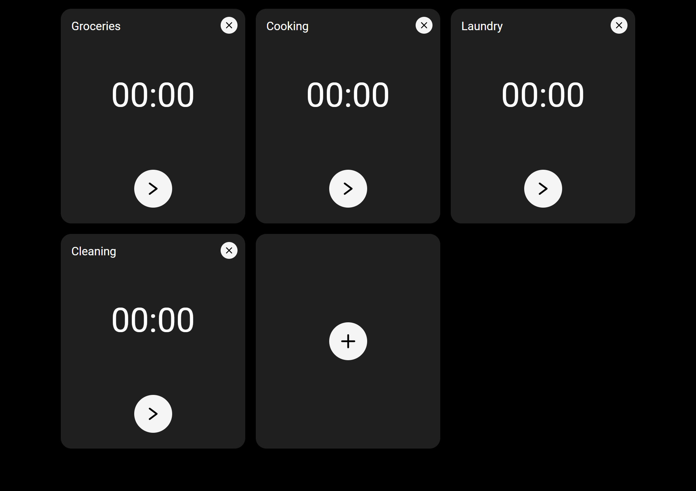

# Task Timer Planner (React)

It enables you to track the time spent on various activities and run multiple timers simultaneously.

It's the conclusion of 12th chapter of [devmentor.pl](https://devmentor.pl/mentoring-javascript) mentoring program.

### 🚀 **Check it here** 👉 https://typee8.github.io/Task-Timer-Panel-Production/

---

### 📌 Key Features:

- 📝 Name Your Activity

- ⏱️ Start / Pause / Save / Delete your timer with ease

- 📜 Check Your History for saved timers

It works efficiently in the background, as long as your browser remains open.
