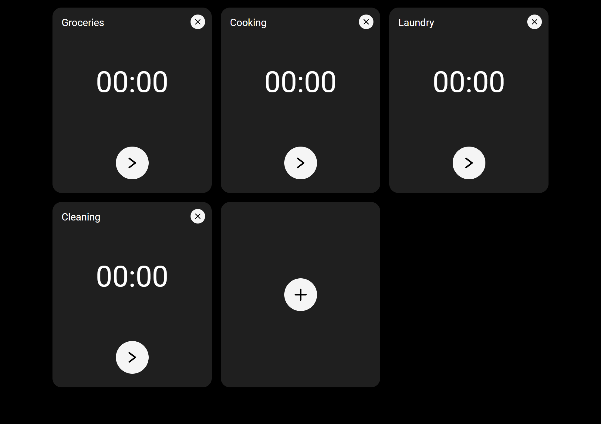

# Task Timer Planner (React)

It's the conclusion of **12th chapter** (there's **20**) of [devmentor.pl](https://devmentor.pl/mentoring-javascript) mentoring program.

## How to check it out:

1. fetch the project.
2. clone it on your pc.

**Make sure you're in the root directory!**

3. use **_npm install_** to install the required packages.
4. in the console write **'ipconfig'** to search for your ip.
5. copy **IPv4 Address** from the console.
6. open ./src/providers/**FetchDataAPI.js**
7. paste your ip to ip variable in the constructor (at the top of the code) and save the file.
8. install jsonServer compatible with this project (**Warning! It's GLOBAL install**) **'npm install json-server@0.17 -g'** in the console to install it.
9. use **_npm run jsonServer_** to enable the app access server's data.
10. use **_npm run start_** to launch the project.

You should be able to see the website on your phone as well. Just connect your phone to the same wifi your pc is. Insert url in your phone's browser: **yourIP:8080**
